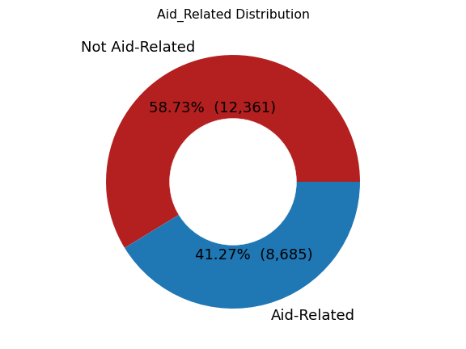

# Labeling Disaster-Related Messages

This notebook follows the processing and modeling behind a text-analysis of disaster-related messages. The texts are a combination of messages, news bulletins, etc.

https://appen.com/datasets/combined-disaster-response-data/


# Trying Out the Model

## Try out the model here!
> https://share.streamlit.io/cwf231/dsc-mod-4-project-v2-1-onl01-dtsc-pt-041320/disaster_response_streamlit.py

## Or...
For an interactive usage of a simple `streamlit` app, you can clone the repo and from the terminal, run the following:

```console
pip install streamlit
streamlit run disaster_response_streamlit.py
```

# Results
 


- Overall, **RNN_glove** (the RNN accompanied by the GloVe weights) performed clearly best overall.
 - On the test set:
   - 83.82% of `aid-related` messages were found.
   - 75.52% of `aid-related` predictions were correct.
   - 80.55% overall accuracy.
- **SVC_glove** (the SVC using Mean Word Embeddings and the GloVe model) performed exceptionally well, performing just below the **RNN_glove** in f1-score (better precision, but worse recall).
- The GloVe model lead to better results than the homemade *W2V* word embedder.
- **RNN_w2v** (an RNN accompanied by the homemade word vectorizer) performed very well also, showing the strength of an RNN model.

# Outline
**Notebook Outline**
- Data Processing
 - Understanding
 - Preparation
   - Process text data.
   - Process target data.
   - Load GloVe model.
   - Create W2V model.
 - EDA
- Modeling
  - scikit-learn 
    - Naive Bayes
    - RFC
    - SVC
    - LogReg
  - TensorFlow 
    - Mean Word Embeddings
    - RNN
    
### Problem
Given text data of disaster-related messages and news bulletins (English / English translation), can we correctly assign labels to the message?
### Objective
Our goal is to create a model that can interpret and label a message using **Natural Language Processing**. A message can have up to 37 labels (for example if the message is requesting medical help or offering aid).

In order to simplify the given dataset, I will be working only with a single label: `aid-related`.

> **Question:** Can we create a model that can correctly label a message as being **aid-related** using only the message itself?

## Data Loading
### What kind of cleaning is required?
1. Drop columns `['id', 'split']`.
2. Examine the text for abnormalities.
3. Combine all the text into one column.
4. Process the text data.
 1. Load in a pre-trained GloVe model. (https://nlp.stanford.edu/projects/glove/)
 2. Fit text on the GloVe model and homemade W2V model, trained on the text.

## Preparation
```
********************************************************************************
*                                 Data Shapes                                  *
********************************************************************************
Processed Training Data:
	(21046, 40)
Processed Val Data:
	(2573, 40)
Processed Test Data:
	(2629, 40)
```
### Text
#### Clean text abnormalities (`html.unescape()`)
#### Tokenize lower-case text.
#### Remove stop-words and punctuation
### Target
#### Set `aid-related` to target column.


```
********************************************************************************
*                                 Column Split                                 *
********************************************************************************
Predictive Columns (X):
	 all_text_tokenized

Target Columns (Y):
	 aid_related
```

### Load in GloVe model
https://nlp.stanford.edu/projects/glove/
### Create W2V model from training data
```
********************************************************************************
*                                  EARTHQUAKE                                  *
********************************************************************************
Most Similar Words:
1.	quake
2.	richter
3.	7.0
4.	aftershock
5.	haiti
6.	7.3
7.	bit.ly
8.	catastrophe
9.	temblor
10.	tinyurl.com


********************************************************************************
*                                     HELP                                     *
********************************************************************************
Most Similar Words:
1.	anything
2.	please
3.	u
4.	food
5.	need
6.	aid
7.	hungry
8.	thank
9.	something
10.	n't


********************************************************************************
*                                   VILLAGE                                    *
********************************************************************************
Most Similar Words:
1.	district
2.	sujawal
3.	area
4.	region
5.	kilometer
6.	camp
7.	county
8.	mountain
9.	hamlet
10.	pir


********************************************************************************
*                                    WATER                                     *
********************************************************************************
Most Similar Words:
1.	drinking
2.	clean
3.	potable
4.	polluted
5.	toilet
6.	tarp
7.	contaminated
8.	chlorine
9.	latrine
10.	food


********************************************************************************
*                                    PEOPLE                                    *
********************************************************************************
Most Similar Words:
1.	person
2.	family
3.	survivor
4.	others
5.	everyone
6.	someone
7.	hungry
8.	resident
9.	child
10.	refuge
```

### EDA & Processing (continued)
#### Message lengths


#### Drop training data with fewer than 4 words.


# Modeling

There are two different data processing methods which will be modeled with. The models' metrics will then be compared and a final model will be selected.

The processing methods are:
- **Mean Word Embeddings**
 - There are two types of embedders we will be using:
   1. Pretrained **GloVe** (Global Vectors for Word Representation - https://nlp.stanford.edu/projects/glove/). 
   2. Homemade **Word2Vec** (a vectorizer trained only on the training data).
 - For each message, every word has an n-dimension representation in vector space (in our case, 100-dimension). 
   - For words that don't exist in the *GloVe* model, they are represented as a vector of zeros.
 - The mean of each sentence's words is calculated and a single n-dimensional vector is used to represent the entire message.
- **Tokenization**
 - This is used in Recurrent Neural Networks to utilize the skill of using *ordered sequences* as they exist.
 - These models use an array representation of each word in a message.
 - The word-representations are learned sequentially and meanings are extrapolated from the order they appear, rather than as a single point.
 
### ML - SKLearn
#### Mean Word Embeddings
##### Naive Bayes, Random Forest Classifier, Support Vector Classifier, Logistic Regression

### TensorFlow Neural Network
#### Mean Word Embeddings, Tokenizing

**Tokenizing Example**
```
********************************************************************************
*                           Tokenizer Created & Fit                            *
********************************************************************************
Ex:
[['weather', 'update', 'cold', 'front', 'cuba', 'could', 'pass', 'haiti'],
 ['says', 'west', 'side', 'haiti', 'rest', 'country', 'today', 'tonight']]
********************************************************************************
*                              Series' Tokenized                               *
********************************************************************************
Ex:
[[109, 1811, 336, 842, 2506, 57, 464, 17],
 [406, 249, 859, 17, 1199, 22, 163, 1044]]
********************************************************************************
*                                  Tokenized                                   *
********************************************************************************
Ex:
array([[   0,    0,    0,    0,    0,    0,    0,    0,    0,    0,    0,
           0,    0,    0,    0,    0,    0,    0,    0,    0,    0,    0,
           0,    0,    0,    0,    0,    0,    0,    0,    0,    0,    0,
           0,    0,    0,    0,    0,    0,    0,    0,    0,    0,    0,
           0,    0,    0,    0,    0,    0,    0,    0,    0,    0,    0,
           0,    0,  109, 1811,  336,  842, 2506,   57,  464,   17],
       [   0,    0,    0,    0,    0,    0,    0,    0,    0,    0,    0,
           0,    0,    0,    0,    0,    0,    0,    0,    0,    0,    0,
           0,    0,    0,    0,    0,    0,    0,    0,    0,    0,    0,
           0,    0,    0,    0,    0,    0,    0,    0,    0,    0,    0,
           0,    0,    0,    0,    0,    0,    0,    0,    0,    0,    0,
           0,    0,  406,  249,  859,   17, 1199,   22,  163, 1044]])
********************************************************************************
*                                   Finished                                   *
********************************************************************************
```

# Conclusion
## Best Model

- The RNN model using GloVe embeddings performed best overall.
 - On the test set:
   - 83.82% of `aid-related` messages were found.
   - 75.52% of `aid-related` predictions were correct.
   - 80.55% overall accuracy.
   
The Recurrent Neural Network (GRU) had the best aptitude for the problem. Its ability to interpret the word sequences proved to be very valuable.

This type of model - with either a more complex topography and/or a much longer training time - would be recommended.
   
## For the future
- Include the multitude of other labels to further identify the messages.
- Experiment with more RNN architectures to try to get better results.
