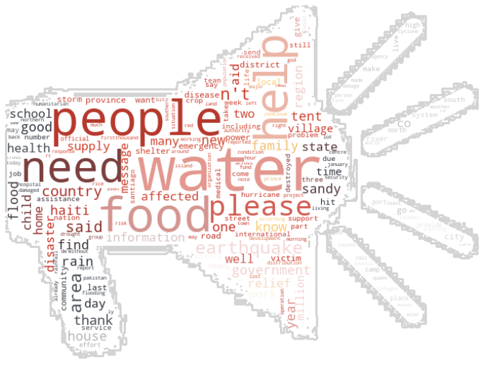
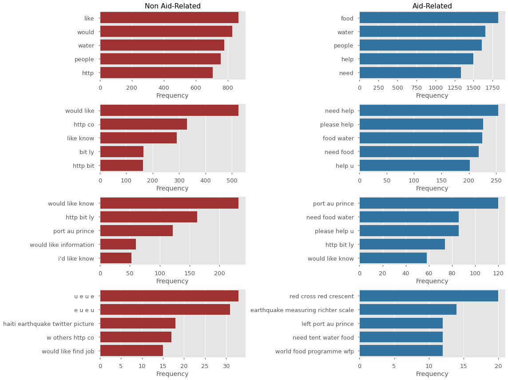

# Labeling Disaster-Related Messages

This notebook follows the processing and modeling behind a text-analysis of disaster-related messages. The texts are a combination of messages, news bulletins, etc.

https://appen.com/datasets/combined-disaster-response-data/




# Using the Model


## Try out the webapp here!
https://share.streamlit.io/cwf231/dsc-mod-4-project-v2-1-onl01-dtsc-pt-041320/disaster_response_streamlit.py

Or...
For an interactive usage of a simple `streamlit` app, you can clone the repo and from the terminal, run the following:

```console
pip install streamlit
streamlit run disaster_response_streamlit.py
```

# Results
 


- Overall, **RNN_glove** (the RNN accompanied by the GloVe weights) performed clearly best overall.
 - On the test set:
   - 80.67% of `aid-related` messages were found.
   - 80.74% of `aid-related` predictions were correct.
   - 82.69% overall accuracy.
- **SVC_glove** (the SVC using Mean Word Embeddings and the GloVe model) performed exceptionally well and was the best of the ML models.
- The GloVe model lead to better results than the homemade *W2V* word embedder.

***
### Model Summary

The results of the modeling is mostly predictable - Neural Networks outperform machine learning models on the whole. However, it is important to note the impressive scores of the **SVC** with Mean Embeddings from the GloVe model. It was overall the third-best model. It was a very solid choice for solving this problem and surpassed many Neural Networks.

You can tell that even though the Logistic Regression model had the best Recall, it was doing so by substantially over-guessing the positive class. The Precision is the lowest out of any model (including the baseline NB), so this high score should be taken with a grain of salt.

As expected, the Recurrent NeuraL Network performed best (with stacked LSTM layers). With a sequential problem like this one, it makes sense that patterns that arise in the texts will be picked up and interpreted.

- If the priority is overall accuracy, confidence in positive predictions, and balance (F1):
  - The **Recurrent Neural Network** with GloVe embeddings scored significantly best: 81% of aid-related predictions were correct, and 83% of its overall predictions were correct.

- If the priority is to find the most aid-related messages (at the expense of mislabeling many messages as aid-related):
  - **Logistic Regression** with the homemade Vectorizer scored the best: finding 86% of all aid-related messages.

Additionally, if used in the field would, this model would save hours of man-power. 
 - **With approximately 2500 messages, the model would save approximately 15 hours of time that would have been spent with a human-labeler.**


# Outline
**Notebook Outline**
- Data Processing
 - Understanding
 - Preparation
   - Process text data.
   - Process target data.
   - Load GloVe model.
   - Create W2V model.
 - EDA
- Modeling
  - scikit-learn 
    - Naive Bayes
    - RFC
    - SVC
    - LogReg
  - TensorFlow 
    - Mean Word Embeddings
    - RNN
    
### Problem
Given text data of disaster-related messages and news bulletins (English / English translation), can we correctly assign labels to the message?
### Objective
Our goal is to create a model that can interpret and label a message using **Natural Language Processing**. A message can have up to 37 labels (for example if the message is requesting medical help or offering aid).

In order to simplify the given dataset, I will be working only with a single label: `aid-related`.

> **Question:** Can we create a model that can correctly label a message as being **aid-related** using only the message itself?

## Data Loading
### What kind of cleaning is required?
1. Drop columns `['id', 'split']`.
2. Examine the text for abnormalities.
3. Combine all the text into one column.
4. Process the text data.
 1. Load in a pre-trained GloVe model. (https://nlp.stanford.edu/projects/glove/)
 2. Fit text on the GloVe model and homemade W2V model, trained on the text.

## Preparation
```
********************************************************************************
*                                 Data Shapes                                  *
********************************************************************************
Processed Training Data:
	(21046, 40)
Processed Val Data:
	(2573, 40)
Processed Test Data:
	(2629, 40)
```
### Text
#### Clean text abnormalities (`html.unescape()`)
#### Tokenize lower-case text.
#### Remove stop-words and punctuation
### Target
#### Set `aid-related` to target column.


```
********************************************************************************
*                                 Column Split                                 *
********************************************************************************
Predictive Columns (X):
	 all_text_tokenized

Target Columns (Y):
	 aid_related
```

### Load in GloVe model
https://nlp.stanford.edu/projects/glove/
### Create W2V model from training data


### EDA & Processing (continued)
#### Message lengths


#### Drop training data with fewer than 4 words.





# Modeling

There are two different data processing methods which will be modeled with. The models' metrics will then be compared and a final model will be selected.

The processing methods are:
- **Mean Word Embeddings**
 - There are two types of embedders we will be using:
   1. Pretrained **GloVe** (Global Vectors for Word Representation - https://nlp.stanford.edu/projects/glove/). 
   2. Homemade **Word2Vec** (a vectorizer trained only on the training data).
 - For each message, every word has an n-dimension representation in vector space (in our case, 100-dimension). 
   - For words that don't exist in the *GloVe* model, they are represented as a vector of zeros.
 - The mean of each sentence's words is calculated and a single n-dimensional vector is used to represent the entire message.
- **Tokenization**
 - This is used in Recurrent Neural Networks to utilize the skill of using *ordered sequences* as they exist.
 - These models use an array representation of each word in a message.
 - The word-representations are learned sequentially and meanings are extrapolated from the order they appear, rather than as a single point.
 
### ML - SKLearn
#### Mean Word Embeddings
##### Naive Bayes, Random Forest Classifier, Support Vector Classifier, Logistic Regression

### TensorFlow Neural Network
#### Mean Word Embeddings, Tokenizing

**Tokenizing Example**
```
********************************************************************************
*                           Tokenizer Created & Fit                            *
********************************************************************************
Ex:
[['weather', 'update', 'cold', 'front', 'cuba', 'could', 'pass', 'haiti'],
 ['says', 'west', 'side', 'haiti', 'rest', 'country', 'today', 'tonight']]
********************************************************************************
*                              Series' Tokenized                               *
********************************************************************************
Ex:
[[109, 1811, 336, 842, 2506, 57, 464, 17],
 [406, 249, 859, 17, 1199, 22, 163, 1044]]
********************************************************************************
*                                  Tokenized                                   *
********************************************************************************
Ex:
array([[   0,    0,    0,    0,    0,    0,    0,    0,    0,    0,    0,
           0,    0,    0,    0,    0,    0,    0,    0,    0,    0,    0,
           0,    0,    0,    0,    0,    0,    0,    0,    0,    0,    0,
           0,    0,    0,    0,    0,    0,    0,    0,    0,    0,    0,
           0,    0,    0,    0,    0,    0,    0,    0,    0,    0,    0,
           0,    0,  109, 1811,  336,  842, 2506,   57,  464,   17],
       [   0,    0,    0,    0,    0,    0,    0,    0,    0,    0,    0,
           0,    0,    0,    0,    0,    0,    0,    0,    0,    0,    0,
           0,    0,    0,    0,    0,    0,    0,    0,    0,    0,    0,
           0,    0,    0,    0,    0,    0,    0,    0,    0,    0,    0,
           0,    0,    0,    0,    0,    0,    0,    0,    0,    0,    0,
           0,    0,  406,  249,  859,   17, 1199,   22,  163, 1044]])
********************************************************************************
*                                   Finished                                   *
********************************************************************************
```

# Conclusion
## Recommendations: Best Model

### For use:
- If the priority is overall accuracy, confidence in positive predictions, and balance (F1):
  - The **Recurrent Neural Network** with GloVe embeddings scored significantly best: 81% of aid-related predictions were correct, and 83% of its overall predictions were correct.

- If the priority is to find the most aid-related messages (at the expense of mislabeling many messages as aid-related):
  - **Logistic Regression** with the homemade Vectorizer scored the best: finding 86% of all aid-related messages.

Additionally, if used in the field would, this model would save hours of man-power. 
 - **With approximately 2500 messages, the model would save approximately 15 hours of time that would have been spent with a human-labeler.**

***

### For construction:

The Recurrent Neural Network (LSTM) had the best aptitude for the problem. Its ability to interpret the word sequences proved to be very valuable.

This type of model - with either a more complex topography and/or a much longer training time - would be recommended.

There are some keys to the architecture that can be noted here:

- Having **several LSTM layers** stacked in a row improved model performance drastically compared to only having a single layer.
- **TimeDistributed layers followed with a Flatten layer** performed better than when the LSTM layers did not return sequential information.
- The **three Dense layers** worked in the balance between too complex and poor performance.
   
## For the future
- Include the multitude of other labels to further identify the messages.
- Experiment with more RNN architectures to try to get better results.
