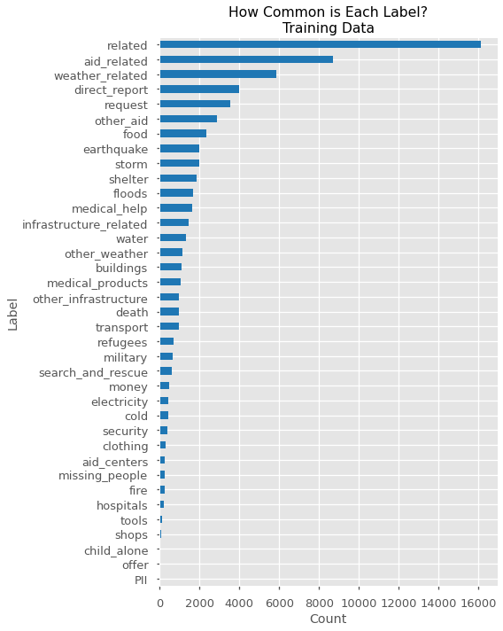
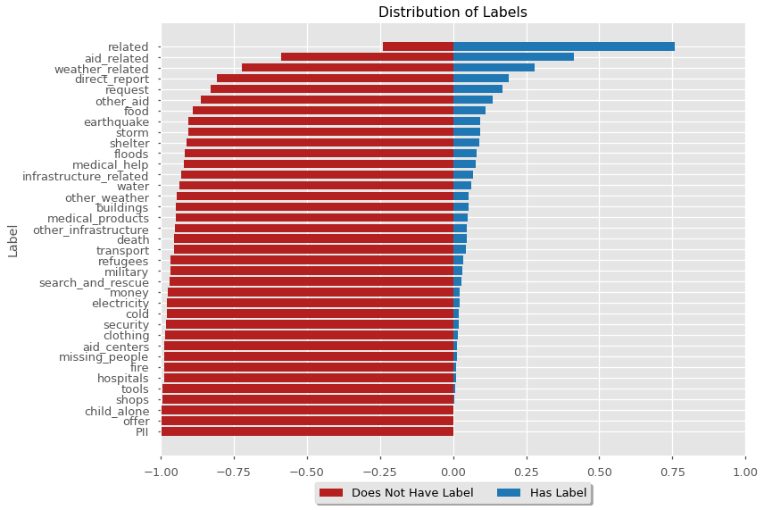
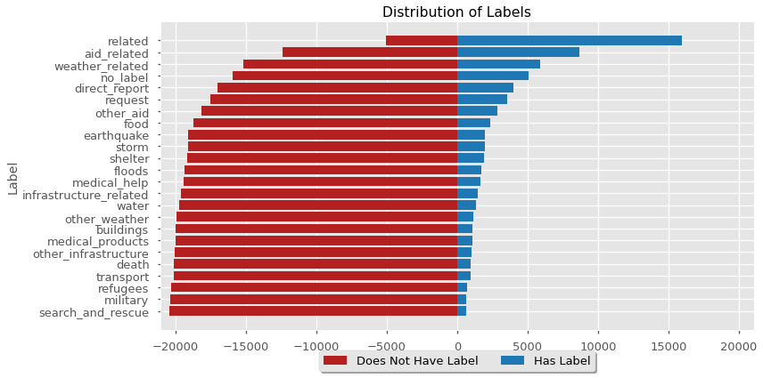
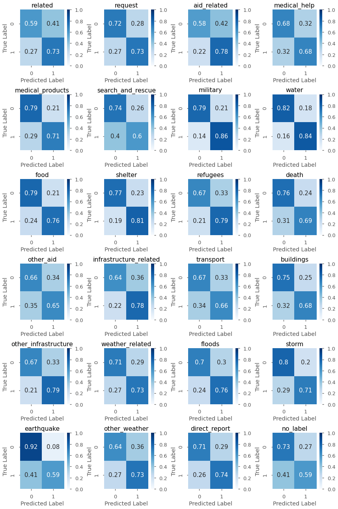
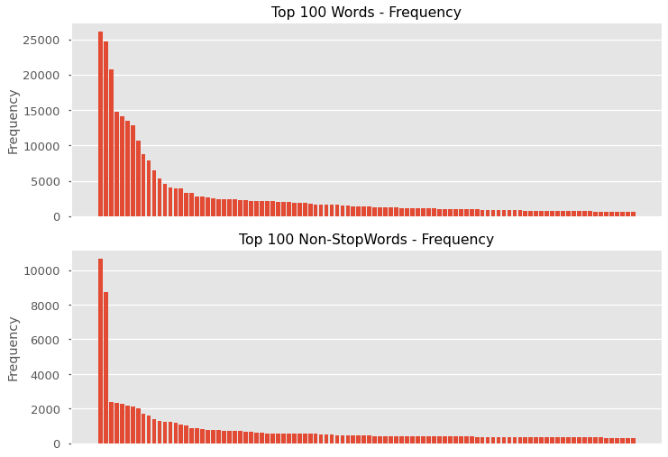

# Labeling Disaster-Related Messages


### Problem
Given text data of disaster-related messages and news bulletins (English / English translation), can we correctly assign labels (tags) to the message?

- Each message can have multiple tags (or no tags) associated with it.

- The task will involve **Natural Language Processing** (*NLP*) analysis.

https://appen.com/datasets/combined-disaster-response-data/

### Objective
Our goal is to create a model that can interpret and label a message using **Natural Language Processing**. There are **37** important labels that a message can have (for example if the message is *requesting medical help* or *offering aid*).

### Success Criteria
It is our goal to build a model that can correctly assign as many labels as possible to each message / bulletin.
We will be using `f1-score` and `hamming_loss` to assess our models.

#### F1-Score
> *Intuitively, precision is the ability of the classifier not to label as positive a sample that is negative, and recall is the ability of the classifier to find all the positive samples.*
>
> *The F-measure (and measures) can be interpreted as a weighted harmonic mean of the precision and recall.*
> https://scikit-learn.org/stable/modules/model_evaluation.html#precision-recall-f-measure-metrics

> ${Recall} = \frac{TP}{TP + FN}$
> 
> ${Precision} = \frac{TP}{TP + FN}$
> 
> $\LARGE {f_1} = 2 \times \frac{precision \times recall}{precision + recall}$

We will be using a mean f1-score (`average='samples'`) which assesses the f1-score of each sample separately and averages them.

```python
>>> y_true = np.array([[1,1,1,1],
>>>                    [1,0,0,0]])
>>> y_pred = np.array([[0,1,1,0],
>>>                    [1,0,0,0]])
>>>
>>> # 2/4 (0.5) true positives correctly labeled on the first entry
>>> # 1/1 (1.0) true positives correctly labeled on the second entry
>>> # 1.0 * 0.5 = 0.75
>>> recall_score(y_true, y_pred, average='samples')
0.75

>>> # Every positive label is correct on both samples
>>> precision_score(y_true, y_pred, average='samples')
1.0

>>> # Sample 1: 2 * ((0.5 * 1) / (0.5 + 1))
>>> # 0.667
>>> # Sample 2: 2 * ((1 * 1) / (1 + 1))
>>> # 1.0
>>> # (0.667 + 1.0) / 2 = 0.8335
>>> f1_score(y_true, y_pred, average='samples')
0.8333333333333333
```

***

#### Hamming Loss
> **Hamming Loss:** The percentage of labels that are incorrectly predicted (or the inverse or an `accuracy_score`). 
> 
> $\LARGE L_{Hamming}(y, \hat{y}) = \frac{1}{n_\text{labels}} \sum_{j=0}^{n_\text{labels} - 1} 1(\hat{y}_j \not= y_j)$
> 
> *https://scikit-learn.org/stable/modules/model_evaluation.html#hamming-loss*

*When assessing multi-label predictions, an `accuracy_score` will return an overly-strict assessment of each row.*

*Either every label is correct (`acc=1`) or there are any number of mis-labels (`acc=0`)).*

Hamming loss will show the number of overall incorrect labels, thereby preferring a prediction with 2/3 correct labels over one with 0/3 correct labels.

```python
>>> y_true = np.array([[1,1,1,1],
>>>                    [1,0,0,0]])
>>> y_pred = np.array([[0,1,1,0],
>>>                    [1,0,0,0]])
>>>
>>> # 2/8 total mislabeled. (0.25)
>>> hamming_loss(y_true, y_pred) 
0.25
```

- **Note**: Since we are measuring a loss, the best model will have the *lowest* score.

***

#### Binary Cross-Entropy
> **Binary Cross-Entropy** (*log-loss*): Similar to the Hamming Loss function, this measures the loss based on how wrong the model's predictions are.
>
> However, Binary Cross-Entropy is able to measure continuous entries rather than just binary.

$\LARGE {cross entropy} = -\sum_{c=1}^My_{o,c}\log(p_{o,c})$

> *Cross-entropy loss, or log loss, measures the performance of a classification model whose output is a probability value between 0 and 1. Cross-entropy loss increases as the predicted probability diverges from the actual label. So predicting a probability of .012 when the actual observation label is 1 would be bad and result in a high loss value. A perfect model would have a log loss of 0.*
>
> *https://ml-cheatsheet.readthedocs.io/en/latest/loss_functions.html*

### Imports


```python
import sys

# the ./support dir contains disaster_response.py
sys.path.append('./support')
```


```python
import pandas as pd
import numpy as np
import matplotlib.pyplot as plt
import seaborn as sns
from wordcloud import WordCloud
%matplotlib inline

import os
import html
import string
from itertools import product

from sklearn.metrics import (f1_score, recall_score, 
                             precision_score, hamming_loss)

from nltk.tokenize import word_tokenize
from nltk.probability import FreqDist
from nltk.corpus import stopwords

from sklearn.multioutput import ClassifierChain
from sklearn.multiclass import OneVsRestClassifier
from sklearn.naive_bayes import GaussianNB
from sklearn.ensemble import RandomForestClassifier
from sklearn.svm import SVC
from sklearn.linear_model import LogisticRegression
from sklearn.pipeline import Pipeline
from sklearn.model_selection import GridSearchCV
from sklearn.feature_extraction.text import CountVectorizer, TfidfVectorizer

import tensorflow as tf
from tensorflow.keras import (
    layers, models, initializers, regularizers, constraints, optimizers
)
from tensorflow.keras.preprocessing import text, sequence
from tensorflow.keras.callbacks import ModelCheckpoint

import kerastuner as kt

# Custom functions and classes for this project.
import disaster_response as dis 
```


```python
# Check that GloVe model exists in the correct directory.
dis.check_for_glove()

# Plot formatting.
plt.style.use(['ggplot', 'seaborn-talk'])

# Set colors for plotting.
COLORS = {
    'blue': '#1f77b4',
    'green': '#2eb41f',
    'yellow': '#b4b21f',
    'red': '#b41f1f',
    'purple': '#b41f94'
}
```

    ********************************************************************************
    *                         SUCCESS - GloVe Model Found                          *
    ********************************************************************************
    

## Data Understanding
### Load in data.


```python
# Checking that the necessary files are in the default directory.
os.listdir('./data/')
```


    ['.ipynb_checkpoints',
     'column_descriptions.csv',
     'disaster_response_messages_test.csv',
     'disaster_response_messages_training.csv',
     'disaster_response_messages_validation.csv']


```python
# Load in data.
dw = dis.DataWarehouse()
```

    ********************************************************************************
    *                           Data loaded sucessfully.                           *
    ********************************************************************************
    ********************************************************************************
    *                                 Data Shapes                                  *
    ********************************************************************************
    Training Data:
    	(21046, 42)
    Val Data:
    	(2573, 42)
    Test Data:
    	(2629, 42)
    
    Column Descriptions:
    	(20, 1)
    

### Explore data.


```python
dw.train.head()
```


<div>
<style scoped>
    .dataframe tbody tr th:only-of-type {
        vertical-align: middle;
    }

    .dataframe tbody tr th {
        vertical-align: top;
    }

    .dataframe thead th {
        text-align: right;
    }
</style>
<table border="1" class="dataframe">
  <thead>
    <tr style="text-align: right;">
      <th></th>
      <th>id</th>
      <th>split</th>
      <th>message</th>
      <th>original</th>
      <th>genre</th>
      <th>related</th>
      <th>PII</th>
      <th>request</th>
      <th>offer</th>
      <th>aid_related</th>
      <th>...</th>
      <th>aid_centers</th>
      <th>other_infrastructure</th>
      <th>weather_related</th>
      <th>floods</th>
      <th>storm</th>
      <th>fire</th>
      <th>earthquake</th>
      <th>cold</th>
      <th>other_weather</th>
      <th>direct_report</th>
    </tr>
  </thead>
  <tbody>
    <tr>
      <td>0</td>
      <td>2</td>
      <td>train</td>
      <td>Weather update - a cold front from Cuba that c...</td>
      <td>Un front froid se retrouve sur Cuba ce matin. ...</td>
      <td>direct</td>
      <td>1</td>
      <td>0</td>
      <td>0</td>
      <td>0</td>
      <td>0</td>
      <td>...</td>
      <td>0</td>
      <td>0</td>
      <td>0</td>
      <td>0</td>
      <td>0</td>
      <td>0</td>
      <td>0</td>
      <td>0</td>
      <td>0</td>
      <td>0</td>
    </tr>
    <tr>
      <td>1</td>
      <td>7</td>
      <td>train</td>
      <td>Is the Hurricane over or is it not over</td>
      <td>Cyclone nan fini osinon li pa fini</td>
      <td>direct</td>
      <td>1</td>
      <td>0</td>
      <td>0</td>
      <td>0</td>
      <td>1</td>
      <td>...</td>
      <td>0</td>
      <td>0</td>
      <td>1</td>
      <td>0</td>
      <td>1</td>
      <td>0</td>
      <td>0</td>
      <td>0</td>
      <td>0</td>
      <td>0</td>
    </tr>
    <tr>
      <td>2</td>
      <td>12</td>
      <td>train</td>
      <td>says: west side of Haiti, rest of the country ...</td>
      <td>facade ouest d Haiti et le reste du pays aujou...</td>
      <td>direct</td>
      <td>1</td>
      <td>0</td>
      <td>0</td>
      <td>0</td>
      <td>0</td>
      <td>...</td>
      <td>0</td>
      <td>0</td>
      <td>0</td>
      <td>0</td>
      <td>0</td>
      <td>0</td>
      <td>0</td>
      <td>0</td>
      <td>0</td>
      <td>0</td>
    </tr>
    <tr>
      <td>3</td>
      <td>14</td>
      <td>train</td>
      <td>Information about the National Palace-</td>
      <td>Informtion au nivaux palais nationl</td>
      <td>direct</td>
      <td>0</td>
      <td>0</td>
      <td>0</td>
      <td>0</td>
      <td>0</td>
      <td>...</td>
      <td>0</td>
      <td>0</td>
      <td>0</td>
      <td>0</td>
      <td>0</td>
      <td>0</td>
      <td>0</td>
      <td>0</td>
      <td>0</td>
      <td>0</td>
    </tr>
    <tr>
      <td>4</td>
      <td>15</td>
      <td>train</td>
      <td>Storm at sacred heart of jesus</td>
      <td>Cyclone Coeur sacr de jesus</td>
      <td>direct</td>
      <td>1</td>
      <td>0</td>
      <td>0</td>
      <td>0</td>
      <td>0</td>
      <td>...</td>
      <td>0</td>
      <td>0</td>
      <td>1</td>
      <td>0</td>
      <td>1</td>
      <td>0</td>
      <td>0</td>
      <td>0</td>
      <td>0</td>
      <td>0</td>
    </tr>
  </tbody>
</table>
<p>5 rows × 42 columns</p>
</div>


```python
dw.train.info()
```

    <class 'pandas.core.frame.DataFrame'>
    RangeIndex: 21046 entries, 0 to 21045
    Data columns (total 42 columns):
    id                        21046 non-null int64
    split                     21046 non-null object
    message                   21046 non-null object
    original                  8191 non-null object
    genre                     21046 non-null object
    related                   21046 non-null int64
    PII                       21046 non-null int64
    request                   21046 non-null int64
    offer                     21046 non-null int64
    aid_related               21046 non-null int64
    medical_help              21046 non-null int64
    medical_products          21046 non-null int64
    search_and_rescue         21046 non-null int64
    security                  21046 non-null int64
    military                  21046 non-null int64
    child_alone               21046 non-null int64
    water                     21046 non-null int64
    food                      21046 non-null int64
    shelter                   21046 non-null int64
    clothing                  21046 non-null int64
    money                     21046 non-null int64
    missing_people            21046 non-null int64
    refugees                  21046 non-null int64
    death                     21046 non-null int64
    other_aid                 21046 non-null int64
    infrastructure_related    21046 non-null int64
    transport                 21046 non-null int64
    buildings                 21046 non-null int64
    electricity               21046 non-null int64
    tools                     21046 non-null int64
    hospitals                 21046 non-null int64
    shops                     21046 non-null int64
    aid_centers               21046 non-null int64
    other_infrastructure      21046 non-null int64
    weather_related           21046 non-null int64
    floods                    21046 non-null int64
    storm                     21046 non-null int64
    fire                      21046 non-null int64
    earthquake                21046 non-null int64
    cold                      21046 non-null int64
    other_weather             21046 non-null int64
    direct_report             21046 non-null int64
    dtypes: int64(38), object(4)
    memory usage: 6.7+ MB
    

- There are a couple columns that are strings (that we'll be working with with NLP).
```python
['message', 'genre']
```
- There are many missing values in the `original` column.
- There is an `id` column which can be dropped.
- There are 37 potential target columns (labels) that are binary.


```python
dw.train['genre'].value_counts()
```


    news      10450
    direct     8666
    social     1930
    Name: genre, dtype: int64


```python
# Check the integrity of the `message` column when the `original` is missing.
dw.train[dw.train['original'].isna()]['message'].head()
```


    5973             NOTES: It mark as not enough information
    7956    My thoughts and prayers go out to all the live...
    7957    lilithia yes 5.2 magnitude earthquake hit mani...
    7958    RT TheNewsBlotter RT caribnews On Call Interna...
    7959    Most Eureka homeowners won&#39 t collect on qu...
    Name: message, dtype: object


```python
# Plot label-counts within the training data.
label_counts = dw.train[dw.target_columns].sum().sort_values()

fig, ax = plt.subplots(figsize=(8, 10))
label_counts.plot(kind='barh', color=COLORS['blue'])
ax.set(title='How Common is Each Label?\nTraining Data',
       ylabel='Label',
       xlabel='Count')
fig.tight_layout()
```





- Some labels are non-existent in the training data which should prove to be a problem.

### Understand what the columns mean.


```python
dw.column_descriptions
```


<div>
<style scoped>
    .dataframe tbody tr th:only-of-type {
        vertical-align: middle;
    }

    .dataframe tbody tr th {
        vertical-align: top;
    }

    .dataframe thead th {
        text-align: right;
    }
</style>
<table border="1" class="dataframe">
  <thead>
    <tr style="text-align: right;">
      <th></th>
      <th>Description</th>
    </tr>
    <tr>
      <th>Column</th>
      <th></th>
    </tr>
  </thead>
  <tbody>
    <tr>
      <td>id</td>
      <td>Unique ID for each individual row</td>
    </tr>
    <tr>
      <td>split</td>
      <td>Test, tune, validation split</td>
    </tr>
    <tr>
      <td>message</td>
      <td>English text of actual messages related to dis...</td>
    </tr>
    <tr>
      <td>original</td>
      <td>Text of column 3 in native language as origina...</td>
    </tr>
    <tr>
      <td>genre</td>
      <td>Type of message, including direct messages, so...</td>
    </tr>
    <tr>
      <td>related</td>
      <td>Is the message disaster related? 1= yes, 2=no</td>
    </tr>
    <tr>
      <td>PII</td>
      <td>Does the message contain PII? 1= yes, 2=no</td>
    </tr>
    <tr>
      <td>request</td>
      <td>Does the message contain a request? 1= yes, 2=no</td>
    </tr>
    <tr>
      <td>offer</td>
      <td>Does the message contain an offer? 1= yes, 2=no</td>
    </tr>
    <tr>
      <td>aid_related</td>
      <td>Is the message aid related? 1= yes, 2=no</td>
    </tr>
    <tr>
      <td>medical_help</td>
      <td>Does the message concern medical help? 1= yes,...</td>
    </tr>
    <tr>
      <td>medical_products</td>
      <td>Does the message concern medical products? 1= ...</td>
    </tr>
    <tr>
      <td>search_and_rescue</td>
      <td>Does the message concern search and rescue? 1=...</td>
    </tr>
    <tr>
      <td>security</td>
      <td>Does the message concern security? 1= yes, 2=no</td>
    </tr>
    <tr>
      <td>military</td>
      <td>Does the message concern military? 1= yes, 2=no</td>
    </tr>
    <tr>
      <td>child_alone</td>
      <td>Does the message mention a child alone? 1= yes...</td>
    </tr>
    <tr>
      <td>water</td>
      <td>Does the message concern water? 1= yes, 2=no</td>
    </tr>
    <tr>
      <td>food</td>
      <td>Does the message concern food? 1= yes, 2=no</td>
    </tr>
    <tr>
      <td>shelter</td>
      <td>Does the message concern shelter? 1= yes, 2=no</td>
    </tr>
    <tr>
      <td>clothing</td>
      <td>Does the message concern clothing? 1= yes, 2=no</td>
    </tr>
  </tbody>
</table>
</div>


- This is pretty predictable. The `message` column has text data (sometimes english translated). Each of the label columns is binary.
  - There is a typo in the label column descriptions: `{1: 'yes', 0: 'no'}`

### What kind of cleaning is required?
1. Drop columns `['id', 'split']`.
2. Examine the text for abnormalities.
3. Combine all the text into one column.
4. Process the text data.
 1. Load in a pre-trained GloVe model. (https://nlp.stanford.edu/projects/glove/)
 2. Fit text on the GloVe model into matrix.

## Data Preparation
### Data cleanup / merging / prep for modeling.


```python
dw.show_data_shapes()
```

    ********************************************************************************
    *                                 Data Shapes                                  *
    ********************************************************************************
    Processed Training Data:
    	(21046, 42)
    Processed Val Data:
    	(2573, 42)
    Processed Test Data:
    	(2629, 42)
    


```python
# Drop unnecessary columns.
dw.drop_column(['id', 'split'])
```

    ********************************************************************************
    *                                   Success                                    *
    ********************************************************************************
    Columns dropped:
    	 ['id', 'split']
    
    ********************************************************************************
    *                                 Data Shapes                                  *
    ********************************************************************************
    Processed Training Data:
    	(21046, 40)
    Processed Val Data:
    	(2573, 40)
    Processed Test Data:
    	(2629, 40)
    

#### Examine abnormalities and clean text.


```python
# Clean HTML escape characters (such as ``&#39`` which maps to an apostrophe).
example_string = [string for string in dw.train['message']
                   if '&#' in string][0]
print(example_string)
print(html.unescape(example_string))
```

    Most Eureka homeowners won&#39 t collect on quake insurance The California Earthquake Authority does not expec. http bit.ly 7RY2qT
    Most Eureka homeowners won' t collect on quake insurance The California Earthquake Authority does not expec. http bit.ly 7RY2qT
    


```python
dw.map_to_all('message', html.unescape)
```

    ********************************************************************************
    *                                   Success                                    *
    ********************************************************************************
    

#### Combine all text into one column. 


```python
# Which columns are we combining?
dw.processed_train.select_dtypes('O').columns
```


    Index(['message', 'original', 'genre'], dtype='object')


```python
# Combine genre with message.
for df in dw.processed_data:
    df['all_text'] = df['genre'] + ' ' + df['message']
    
dw.processed_train['all_text'].head()
```


    0    direct Weather update - a cold front from Cuba...
    1       direct Is the Hurricane over or is it not over
    2    direct says: west side of Haiti, rest of the c...
    3        direct Information about the National Palace-
    4                direct Storm at sacred heart of jesus
    Name: all_text, dtype: object


#### Tokenize lower-case text.


```python
# Set new column as copy to maintain original integrity.
for df in dw.processed_data:
    df['all_text_tokenized'] = df['all_text'].copy()
```


```python
# Map all text to lower case.
dw.map_to_all('all_text_tokenized', lambda x: x.lower())
```

    ********************************************************************************
    *                                   Success                                    *
    ********************************************************************************
    


```python
# Tokenize text into lists.
dw.map_to_all('all_text_tokenized', word_tokenize)
```

    ********************************************************************************
    *                                   Success                                    *
    ********************************************************************************
    


```python
dw.processed_train['all_text_tokenized'][0]
```


    ['direct',
     'weather',
     'update',
     '-',
     'a',
     'cold',
     'front',
     'from',
     'cuba',
     'that',
     'could',
     'pass',
     'over',
     'haiti']


#### Set DataWarehouse's column structure.


```python
dw.predictive_columns = 'all_text_tokenized'
dw.show_column_split()
```

    ********************************************************************************
    *                                 Column Split                                 *
    ********************************************************************************
    Predictive Columns (X):
    	 all_text_tokenized
    
    Target Columns (Y):
    	 ['related', 'PII', 'request', 'offer', 'aid_related', 'medical_help', 'medical_products', 'search_and_rescue', 'security', 'military', 'child_alone', 'water', 'food', 'shelter', 'clothing', 'money', 'missing_people', 'refugees', 'death', 'other_aid', 'infrastructure_related', 'transport', 'buildings', 'electricity', 'tools', 'hospitals', 'shops', 'aid_centers', 'other_infrastructure', 'weather_related', 'floods', 'storm', 'fire', 'earthquake', 'cold', 'other_weather', 'direct_report']
    

#### Inspect target_columns.


```python
for col in dw.target_columns:
    vc = dw.processed_train[col].value_counts()
    if len(vc) != 2:
        display(vc)
```


    1    15795
    0     5083
    2      168
    Name: related, dtype: int64


    0    21046
    Name: PII, dtype: int64


    0    21046
    Name: offer, dtype: int64


    0    21046
    Name: child_alone, dtype: int64


*There is an abnormality with the `'related'` column - there are three values.* 

*Since the target should be binary, I'm going to set the few '2' entries to 0 (ie: not related).*


```python
# Set the related column to binary.
dw.map_to_all('related', lambda x: 0 if x == 0 else 1)
```

    ********************************************************************************
    *                                   Success                                    *
    ********************************************************************************
    


```python
# Plot stacked percentage bar chart.
dw.plot_label_distribution('train',
                           normalize=True,
                           figsize=(12,8),
                           positive_color=COLORS['blue'],
                           negative_color=COLORS['red'])
```





*Most of the labels are very rare (or non-existent).*

*For handling these, I'm going to ignore labels that show up in less than 2.5% of entries.*


```python
# Drop labels which are present in less than 2.5% of training data.
twoptfive_percent = len(dw.Y_train()) * 0.025
total_labels = dw.processed_train[dw.target_columns].sum()
less_than_twoptfive_percent = total_labels[total_labels < twoptfive_percent]
less_than_twoptfive_percent
```


    PII                 0
    offer               0
    security          402
    child_alone         0
    clothing          323
    money             487
    missing_people    252
    electricity       449
    tools             140
    hospitals         228
    shops              99
    aid_centers       258
    fire              239
    cold              425
    dtype: int64


```python
# Drop columns.
dw.drop_column(list(less_than_twoptfive_percent.index))
```

    ********************************************************************************
    *                                   Success                                    *
    ********************************************************************************
    Columns dropped:
    	 ['PII', 'offer', 'security', 'child_alone', 'clothing', 'money', 'missing_people', 'electricity', 'tools', 'hospitals', 'shops', 'aid_centers', 'fire', 'cold']
    
    ********************************************************************************
    *                                 Data Shapes                                  *
    ********************************************************************************
    Processed Training Data:
    	(21046, 28)
    Processed Val Data:
    	(2573, 28)
    Processed Test Data:
    	(2629, 28)
    


```python
print('Target Columns:\n\t', len(dw.target_columns))
```

    Target Columns:
    	 23
    

#### Are there entries with no labels?


```python
num_labels_train = dw.processed_train[dw.target_columns].sum(axis=1)
num_labels_val = dw.processed_val[dw.target_columns].sum(axis=1)

eq_0_train = num_labels_train[num_labels_train == 0]
eq_0_val = num_labels_val[num_labels_val == 0]

num_no_label_train = len(eq_0_train)
num_no_label_val = len(eq_0_val)
print('Entries with no labels:')
print('Training:  ', 
      num_no_label_train,
      f'\t{round(num_no_label_train/len(num_labels_train), 5) * 100}%')
print('Validation:', 
      num_no_label_val,
      f'\t{round(num_no_label_val/len(num_labels_val), 5) * 100}%')
```

    Entries with no labels:
    Training:   5083 	24.152%
    Validation: 632 	24.563%
    


```python
# Sample text from no-label data.
idx_lst = eq_0_train.index[:10]
samples = dw.processed_train.loc[idx_lst][dw.predictive_columns]
for i, lst in zip(idx_lst, samples.values):
    print(f'{i}\t{" ".join(lst)}')
```

    3	direct information about the national palace-
    6	direct i would like to receive the messages , thank you
    8	direct i am in petionville . i need more information regarding 4636
    14	direct i do n't understand how to use this thing 4636 .
    21	direct can you tell me about this service
    24	direct good evening , radio one please . i would like information on tiyous .
    26	direct i 'm here , i did n't find the person that i needed to send the pant by phone
    43	direct i 'm listening to you at miraguan we asking the government to take change because one gallon gas is 80 .
    54	direct i am very happy , i hear god , religious hyme
    65	direct i would like to know how food is distributed .
    


```python
# Create label - no_label.
for df in dw.processed_data:
    df['no_label'] = (df[dw.target_columns].sum(axis=1) == 0).astype(int)
    
dw.processed_train['no_label'].head()
```


    0    0
    1    0
    2    0
    3    1
    4    0
    Name: no_label, dtype: int32


```python
# Append target_columns.
dw.target_columns.append('no_label')

dw.show_column_split()
```

    ********************************************************************************
    *                                 Column Split                                 *
    ********************************************************************************
    Predictive Columns (X):
    	 all_text_tokenized
    
    Target Columns (Y):
    	 ['related', 'request', 'aid_related', 'medical_help', 'medical_products', 'search_and_rescue', 'military', 'water', 'food', 'shelter', 'refugees', 'death', 'other_aid', 'infrastructure_related', 'transport', 'buildings', 'other_infrastructure', 'weather_related', 'floods', 'storm', 'earthquake', 'other_weather', 'direct_report', 'no_label']
    


```python
dw.plot_label_distribution('train',
                           figsize=(12, 6),
                           positive_color=COLORS['blue'],
                           negative_color=COLORS['red'])
```





### Load GloVe.


```python
# Set up total_vocabulary set with all unique words in all texts.
total_vocab = set(
    [word for entry in dw.processed_train[dw.predictive_columns].values 
     for word in entry]
)
print('Total unique words:', len(total_vocab))
```

    Total unique words: 35547
    


```python
# Load in pretrained GloVe model.
glove = {}

with open('./models/glove.6B.100d.txt', 'rb') as f:
    for line in f:
        line_split = line.split()
        word = line_split[0].decode('utf-8')
        if word in total_vocab:
            word_vector = np.array(line_split[1:], dtype=np.float32)
            glove[word] = word_vector
            
print('Total words loaded from GloVe:', len(glove))
```

    Total words loaded from GloVe: 24988
    

### Word Frequencies / WordCloud


```python
# Stopwords list.
sw = stopwords.words('english')
sw += string.digits
sw += string.punctuation

all_words = [w for entry in dw.processed_train['all_text_tokenized'].values 
             for w in entry 
             if w not in sw]
```


```python
# Total vocabulary.
wordcloud = WordCloud(width=3000, 
                      height=2000, 
                      random_state=51, 
                      background_color=COLORS['blue'], 
                      colormap='spring', 
                      collocations=False).generate(' '.join(all_words))
```


```python
dis.plot_wordcloud(wordcloud)
```


### What are the most common words for each label?


```python
top_10_words = {}
for col in dw.target_columns:
    print(col)
    col_vocab = [
        word for entry in dw.processed_train[
            dw.processed_train[col] == 1]['all_text_tokenized'].values
        for word in entry if word not in sw
    ]
    top_10_words[col] = ' '.join(col_vocab)
```

    related
    request
    aid_related
    medical_help
    medical_products
    search_and_rescue
    military
    water
    food
    shelter
    refugees
    death
    other_aid
    infrastructure_related
    transport
    buildings
    other_infrastructure
    weather_related
    floods
    storm
    earthquake
    other_weather
    direct_report
    no_label
    


```python
# Show all wordclouds.
for col in top_10_words:
    wordcloud = WordCloud(width=1100, 
                          height=200, 
                          max_words=20,
                          random_state=51, 
                          background_color=COLORS['blue'], 
                          colormap='spring', 
                          collocations=False).generate(top_10_words[col])
    print(dis.headerize(col.upper()))
    dis.plot_wordcloud(wordcloud, figsize=(11,2))
```

    ********************************************************************************
    *                                   RELATED                                    *
    ********************************************************************************
    


    ********************************************************************************
    *                                   REQUEST                                    *
    ********************************************************************************
    


    ********************************************************************************
    *                                 AID_RELATED                                  *
    ********************************************************************************
    


    ********************************************************************************
    *                                 MEDICAL_HELP                                 *
    ********************************************************************************
    


    ********************************************************************************
    *                               MEDICAL_PRODUCTS                               *
    ********************************************************************************
    


    ********************************************************************************
    *                              SEARCH_AND_RESCUE                               *
    ********************************************************************************
    


    ********************************************************************************
    *                                   MILITARY                                   *
    ********************************************************************************
    


    ********************************************************************************
    *                                    WATER                                     *
    ********************************************************************************
    


    ********************************************************************************
    *                                     FOOD                                     *
    ********************************************************************************
    


    ********************************************************************************
    *                                   SHELTER                                    *
    ********************************************************************************
    


    ********************************************************************************
    *                                   REFUGEES                                   *
    ********************************************************************************
    


    ********************************************************************************
    *                                    DEATH                                     *
    ********************************************************************************
    


    ********************************************************************************
    *                                  OTHER_AID                                   *
    ********************************************************************************
    


    ********************************************************************************
    *                            INFRASTRUCTURE_RELATED                            *
    ********************************************************************************
    


    ********************************************************************************
    *                                  TRANSPORT                                   *
    ********************************************************************************
    


    ********************************************************************************
    *                                  BUILDINGS                                   *
    ********************************************************************************
    


    ********************************************************************************
    *                             OTHER_INFRASTRUCTURE                             *
    ********************************************************************************
    


    ********************************************************************************
    *                               WEATHER_RELATED                                *
    ********************************************************************************
    


    ********************************************************************************
    *                                    FLOODS                                    *
    ********************************************************************************
    


    ********************************************************************************
    *                                    STORM                                     *
    ********************************************************************************
    


    ********************************************************************************
    *                                  EARTHQUAKE                                  *
    ********************************************************************************
    


    ********************************************************************************
    *                                OTHER_WEATHER                                 *
    ********************************************************************************
    


    ********************************************************************************
    *                                DIRECT_REPORT                                 *
    ********************************************************************************
    


    ********************************************************************************
    *                                   NO_LABEL                                   *
    ********************************************************************************
    


## Modeling

### Baseline Model - Naive Bayes

#### `OneVsRestClassifier`


```python
# Set up OvR Pipeline.
mean_embedder = dis.MeanEmbedder(glove)
ovr = OneVsRestClassifier(GaussianNB())

ovr_pipe = Pipeline([
    ('Mean_WordEmbedder', mean_embedder),
    ('OVR_Logistic_Regression', ovr)
])

# Fit / predict.
dis.fit_predict_model(clf=ovr_pipe,
                      X_train=dw.X_train(), 
                      Y_train=dw.Y_train(),
                      X_val=dw.X_val(),
                      Y_val=dw.Y_val(),
                      header='OneVsRest Classifier - Naive Bayes',
                      target_column_names=dw.target_columns,
                      plot_confusion=True)
```

    ********************************************************************************
    *                      OneVsRest Classifier - Naive Bayes                      *
    ********************************************************************************
    F1 Score:        0.4017763432596481
    Hamming Loss:    0.2746955564192253
    Recall Score:    0.6896248923163031
    Precision Score: 0.3410764610714615
    





### SKLearn modeling:

#### GloVe Model


```python
RUN_GRIDSEARCH = False
```


```python
# GridSearch with Naive Bayes for random state suggestion.
# Not foolproof, but computationally cheap 
# compared to the other model types.
if RUN_GRIDSEARCH:
    mean_embedder = dis.MeanEmbedder(glove)
    nb_chain = ClassifierChain(GaussianNB(), order='random')

    nb_chain_pipe = Pipeline([
        ('Mean_WordEmbedder', mean_embedder),
        ('NB_Chain', nb_chain)
    ])
    
    # Iterate over first 300 random states of the ClassifierChain.
    chain_params = {
        'NB_Chain__random_state': range(300)
    }

    nb_grid = GridSearchCV(nb_chain_pipe,
                           chain_params,
                           cv=3)

    nb_grid.fit(dw.X_train(), dw.Y_train())
    
    BEST_R_STATE = nb_grid.best_params_['NB_Chain__random_state']
else:
    # From previous GridSearch.
    BEST_R_STATE = 162
```

#### `RandomForestClassifier`, `SupportVectorClassifier`, `Logistic Regression`

Using a `ClassifierChain`, each of these models will be fit for each target label (for a total of 24 models). In real time, they fit their next column's predictions on the previous trained model-chain in order to capture any potential dependence or interactions from one label to another. 


```python
FIT_VANILLA_MODELS = False
```


```python
if FIT_VANILLA_MODELS:
    # Fit vanilla rfc, svc, lr models through a ClassifierChain
    # with a preset random state for the ClassifierChain.
    mean_embedder = dis.MeanEmbedder(glove)
    classifiers = [
        ('Random Forest Classifier', RandomForestClassifier(n_estimators=100,
                                                            random_state=51)),
        ('Support Vector Classifier', SVC(gamma='auto', 
                                          random_state=51)),
        ('Logistic Regression', LogisticRegression(solver='liblinear', 
                                                   random_state=51))
    ]

    for name, clf in classifiers:
        # Build pipeline.
        pipe = Pipeline([
            ('Mean Word Embedder', mean_embedder),
            (name, ClassifierChain(clf, random_state=BEST_R_STATE))
        ],
        verbose=True)

        # Fit / predict.
        dis.fit_predict_model(clf=pipe,
                              X_train=dw.X_train(), 
                              Y_train=dw.Y_train(),
                              X_val=dw.X_val(),
                              Y_val=dw.Y_val(),
                              header=f'{name} - Classifier Chain',
                              return_pred=False,
                              plot_confusion=False)
        print('\n\n')
```

#### Printout
```
[Pipeline]  (step 1 of 2) Processing Mean Word Embedder, total=   0.7s
[Pipeline]  (step 2 of 2) Processing Random Forest Classifier, total= 5.0min
********************************************************************************
*                 Random Forest Classifier - Classifier Chain                  *
********************************************************************************
F1 Score:        0.5710163249081317
Hamming Loss:    0.08904974737660319
Recall Score:    0.5472725179024761
Precision Score: 0.7341680084392871


[Pipeline]  (step 1 of 2) Processing Mean Word Embedder, total=   0.7s
[Pipeline]  (step 2 of 2) Processing Support Vector Classifier, total= 5.7min
********************************************************************************
*                 Support Vector Classifier - Classifier Chain                 *
********************************************************************************
F1 Score:        0.5623548025014372
Hamming Loss:    0.09539771991190568
Recall Score:    0.5543209074569811
Precision Score: 0.7004117853904095


[Pipeline]  (step 1 of 2) Processing Mean Word Embedder, total=   0.8s
[Pipeline]  (step 2 of 2) Processing Logistic Regression, total=  16.6s
********************************************************************************
*                    Logistic Regression - Classifier Chain                    *
********************************************************************************
F1 Score:        0.6101570344619741
Hamming Loss:    0.0889525845316751
Recall Score:    0.6253651897561501
Precision Score: 0.713446258150883
```

#### Vectorized Words


```python
# Vectorize data.
vectorizer = TfidfVectorizer()

X_train_vec = vectorizer.fit_transform(dw.X_train('all_text'))
X_val_vec = vectorizer.transform(dw.X_val('all_text'))

print(f'Data Shape:\t{X_train_vec.shape}')
print(f'Vocab Size:\t{len(vectorizer.vocabulary_)}')
```

    Data Shape:	(21046, 31233)
    Vocab Size:	31233
    


```python
FIT_RFC = False
```


```python
if FIT_RFC:
    # Fit Random Forest on vectorized data.
    rfc = RandomForestClassifier(n_estimators=100)
    dis.fit_predict_model(clf=rfc,
                          X_train=X_train_vec, 
                          Y_train=dw.Y_train(),
                          X_val=X_val_vec,
                          Y_val=dw.Y_val(),
                          header=f'Vectorized Data - RFC',
                          return_pred=False,
                          plot_confusion=False)
    
    ## Plot Feature Importance
    importance = pd.Series(rfc.feature_importances_,
                           index=vectorizer.get_feature_names())

    ## Take the .tail 30 and plot kind='barh'
    fig, ax = plt.subplots()
    importance.sort_values().tail(30).plot(kind='barh', ax=ax)
    ax.set(title='RFC Most Important Words',
           ylabel='Word')
    fig.tight_layout()
```

```
********************************************************************************
*                            Vectorized Data - RFC                             *
********************************************************************************
F1 Score:        0.565732846236565
Hamming Loss:    0.08791618085244203
Recall Score:    0.5133412515028162
Precision Score: 0.778616771232395
```


### Train Recurrent Neural Network (*RNN*).

#### Processing - Tokenize Data


```python
# Number of unique words.
freq_dist = FreqDist([word.lower() 
                      for entry in dw.X_train() 
                      for word in entry])
```


```python
# Plot frequencies for most common 100 words.
top_100 = [x[1] for x in freq_dist.most_common(100)]
top_100_no_sw = [x[1] for x in freq_dist.most_common() 
                 if x[0] not in sw][:100]

fig, (ax1, ax2) = plt.subplots(nrows=2, sharex=True)
ax1.bar(range(100), top_100)
ax2.bar(range(100), top_100_no_sw)

ax1.set(title='Top 100 Words - Frequency',
       ylabel='Frequency')
ax1.set_xticks([])
ax2.set(title='Top 100 Non-StopWords - Frequency',
       ylabel='Frequency')
ax2.set_xticks([])

fig.tight_layout()
```





```python
# Create padded tokens of 'all_text' from DataWarehouse.
all_text_lst = [dw.X_train(), dw.X_val(), dw.X_test()]
num_words = 20_000

tokenizer, (X_train_tok, X_val_tok, X_test_tok) = dis.tokenize_series(
    dw.X_train(),
    all_text_lst,
    num_words=num_words)
```

    ********************************************************************************
    *                           Tokenizer Created & Fit                            *
    ********************************************************************************
    Ex:
    


    [['direct',
      'weather',
      'update',
      '-',
      'a',
      'cold',
      'front',
      'from',
      'cuba',
      'that',
      'could',
      'pass',
      'over',
      'haiti'],
     ['direct', 'is', 'the', 'hurricane', 'over', 'or', 'is', 'it', 'not', 'over']]


    ********************************************************************************
    *                              Series' Tokenized                               *
    ********************************************************************************
    Ex:
    


    [[9, 206, 1968, 66, 10, 451, 983, 28, 2666, 17, 145, 569, 96, 79],
     [9, 13, 1, 151, 96, 68, 13, 30, 44, 96]]


    ********************************************************************************
    *                                  Tokenized                                   *
    ********************************************************************************
    Ex:
    


    array([[   0,    0,    0,    0,    0,    0,    0,    0,    0,    0,    0,
               0,    0,    0,    0,    0,    0,    0,    0,    0,    0,    0,
               0,    0,    0,    0,    0,    0,    0,    0,    0,    0,    0,
               0,    0,    0,    0,    0,    0,    0,    0,    0,    0,    0,
               0,    0,    0,    0,    0,    0,    0,    0,    0,    0,    0,
               0,    0,    0,    0,    0,    0,    0,    0,    0,    0,    0,
               0,    0,    0,    0,    0,    0,    0,    0,    0,    0,    0,
               0,    0,    0,    0,    0,    0,    0,    0,    0,    9,  206,
            1968,   66,   10,  451,  983,   28, 2666,   17,  145,  569,   96,
              79],
           [   0,    0,    0,    0,    0,    0,    0,    0,    0,    0,    0,
               0,    0,    0,    0,    0,    0,    0,    0,    0,    0,    0,
               0,    0,    0,    0,    0,    0,    0,    0,    0,    0,    0,
               0,    0,    0,    0,    0,    0,    0,    0,    0,    0,    0,
               0,    0,    0,    0,    0,    0,    0,    0,    0,    0,    0,
               0,    0,    0,    0,    0,    0,    0,    0,    0,    0,    0,
               0,    0,    0,    0,    0,    0,    0,    0,    0,    0,    0,
               0,    0,    0,    0,    0,    0,    0,    0,    0,    0,    0,
               0,    0,    9,   13,    1,  151,   96,   68,   13,   30,   44,
              96]])


    ********************************************************************************
    *                                   Finished                                   *
    ********************************************************************************
    


```python
# Set embedding size for models.
embedding_size = 128
```

#### LSTM


```python
TRAIN_LSTM = False
```


```python
lstm_model = dis.build_model(num_words, embedding_size, lstm=True)
lstm_model.summary()
```

    Model: "sequential"
    _________________________________________________________________
    Layer (type)                 Output Shape              Param #   
    =================================================================
    embedding (Embedding)        (None, None, 128)         2560000   
    _________________________________________________________________
    lstm (LSTM)                  (None, None, 128)         131584    
    _________________________________________________________________
    global_max_pooling1d (Global (None, 128)               0         
    _________________________________________________________________
    dropout (Dropout)            (None, 128)               0         
    _________________________________________________________________
    dense (Dense)                (None, 50)                6450      
    _________________________________________________________________
    dropout_1 (Dropout)          (None, 50)                0         
    _________________________________________________________________
    dense_1 (Dense)              (None, 24)                1224      
    =================================================================
    Total params: 2,699,258
    Trainable params: 2,699,258
    Non-trainable params: 0
    _________________________________________________________________
    


```python
lstm_checkpoint_path = "models/model_callbacks/lstm/cp.ckpt"
lstm_checkpoint_dir = os.path.dirname(lstm_checkpoint_path)

if TRAIN_LSTM:
    # Create a callback that saves the model's weights
    lstm_callback = ModelCheckpoint(filepath=lstm_checkpoint_path,
                                    save_weights_only=True,
                                    verbose=1)

    lstm_model_history = lstm_model.fit(X_train_tok, 
                                        dw.Y_train(), 
                                        epochs=5, 
                                        batch_size=32, 
                                        validation_data=(X_val_tok, 
                                                         dw.Y_val()),
                                        callbacks=[lstm_callback])
elif os.listdir(lstm_checkpoint_dir):
    # Load in pretrained weights.
    lstm_model.load_weights(lstm_checkpoint_path)
```


```python
# Find optimal prediction threshold.
y_val_pred = lstm_model.predict(X_val_tok)

dis.fit_thresholds(dw.Y_val(), y_val_pred, 'f1_score')
```

    ********************************************************************************
    *            Optimal Threshold: 0.5. Top Score: 0.6337388124098232             *
    ********************************************************************************
    ********************************************************************************
    *                                   F1_SCORE                                   *
    ********************************************************************************
    F1 Score:        0.6337388124098232
    Hamming Loss:    0.08794856846741805
    Recall Score:    0.7345297713927832
    Precision Score: 0.6674393426239521
    

#### GRU


```python
TRAIN_GRU = False
```


```python
gru_model = dis.build_model(num_words, embedding_size, gru=True)
gru_model.summary()
```

    Model: "sequential_1"
    _________________________________________________________________
    Layer (type)                 Output Shape              Param #   
    =================================================================
    embedding_1 (Embedding)      (None, None, 128)         2560000   
    _________________________________________________________________
    gru (GRU)                    (None, None, 128)         99072     
    _________________________________________________________________
    global_max_pooling1d_1 (Glob (None, 128)               0         
    _________________________________________________________________
    dropout_2 (Dropout)          (None, 128)               0         
    _________________________________________________________________
    dense_2 (Dense)              (None, 50)                6450      
    _________________________________________________________________
    dropout_3 (Dropout)          (None, 50)                0         
    _________________________________________________________________
    dense_3 (Dense)              (None, 24)                1224      
    =================================================================
    Total params: 2,666,746
    Trainable params: 2,666,746
    Non-trainable params: 0
    _________________________________________________________________
    


```python
gru_checkpoint_path = "models/model_callbacks/gru/cp.ckpt"
gru_checkpoint_dir = os.path.dirname(gru_checkpoint_path)

if TRAIN_GRU:
    # Create a callback that saves the model's weights
    gru_callback = ModelCheckpoint(filepath=gru_checkpoint_path,
                                   save_weights_only=True,
                                   verbose=1)

    gru_model_history = gru_model.fit(X_train_tok, 
                                      dw.Y_train(), 
                                      epochs=5, 
                                      batch_size=32, 
                                      validation_data=(X_val_tok, 
                                                       dw.Y_val()),
                                      callbacks=[gru_callback])
elif os.listdir(gru_checkpoint_dir):
    # Load in pretrained weights.
    gru_model.load_weights(gru_checkpoint_path)
```


```python
# Find optimal prediction threshold.
y_val_pred = gru_model.predict(X_val_tok)

dis.fit_thresholds(dw.Y_val(), y_val_pred, 'f1_score')
```

    ********************************************************************************
    *             Optimal Threshold: 0.4. Top Score: 0.638912734679877             *
    ********************************************************************************
    ********************************************************************************
    *                                   F1_SCORE                                   *
    ********************************************************************************
    F1 Score:        0.638912734679877
    Hamming Loss:    0.08968130586863583
    Recall Score:    0.7736571368169869
    Precision Score: 0.6367459083646413
    

#### Keras Tuner - Hyperband


```python
RUN_TUNER = False
```


```python
if RUN_TUNER:
    keras_tuner_dir = './models/keras_tuner'
    
    tuner = dis.keras_tuner_hyperband(X_train_tok,
                                      dw.Y_train(),
                                      X_val_tok, 
                                      dw.Y_val(),
                                      directory=keras_tuner_dir)
    
    best_hps = tuner.get_best_hyperparameters(num_trials=1)[0]
    model = tuner.hypermodel.build(best_hps)
    model.fit(X_train_tok, 
              dw.Y_train(), 
              epochs=10, 
              batch_size=32, 
              validation_data=(X_val_tok, 
                               dw.Y_val()))
```

```
********************************************************************************
*                               Tuning Complete                                *
********************************************************************************
Optimal Settings:
	GRU UNITS           : 224
	DENSE UNITS         : 416
	LEARNING RATE       : 0.001
    ```


```python
GRU_UNITS = 224
DENSE_UNITS = 416
LEARNING_RATE = 0.001
```


```python
# Build optimal model.
gru_tuned_model = dis.build_model(num_words, 
                                  embedding_size,
                                  gru=True,
                                  gru_units=GRU_UNITS,
                                  dense_units=DENSE_UNITS,
                                  learning_rate=LEARNING_RATE)
gru_tuned_model.summary()
```

    Model: "sequential_2"
    _________________________________________________________________
    Layer (type)                 Output Shape              Param #   
    =================================================================
    embedding_2 (Embedding)      (None, None, 128)         2560000   
    _________________________________________________________________
    gru_1 (GRU)                  (None, None, 224)         237888    
    _________________________________________________________________
    global_max_pooling1d_2 (Glob (None, 224)               0         
    _________________________________________________________________
    dropout_4 (Dropout)          (None, 224)               0         
    _________________________________________________________________
    dense_4 (Dense)              (None, 416)               93600     
    _________________________________________________________________
    dropout_5 (Dropout)          (None, 416)               0         
    _________________________________________________________________
    dense_5 (Dense)              (None, 24)                10008     
    =================================================================
    Total params: 2,901,496
    Trainable params: 2,901,496
    Non-trainable params: 0
    _________________________________________________________________
    


```python
TRAIN_GRU_TUNED = False
```


```python
gru_tuned_checkpoint_path = "models/model_callbacks/gru_tuned/cp.ckpt"
gru_tuned_checkpoint_dir = os.path.dirname(gru_tuned_checkpoint_path)

if TRAIN_GRU_TUNED:
    # Create a callback that saves the model's weights
    gru_tuned_callback = ModelCheckpoint(filepath=gru_tuned_checkpoint_path,
                                         save_weights_only=True,
                                         verbose=1)

    gru_tuned_model_history = gru_tuned_model.fit(
        X_train_tok, 
        dw.Y_train(), 
        epochs=5, 
        batch_size=32, 
        validation_data=(X_val_tok, dw.Y_val()),
        callbacks=[gru_tuned_callback])

elif os.listdir(gru_tuned_checkpoint_dir):
    # Load in pretrained weights.
    gru_tuned_model.load_weights(gru_tuned_checkpoint_path)
```


```python
# Find optimal prediction threshold.
y_val_pred = gru_tuned_model.predict(X_val_tok)

dis.fit_thresholds(dw.Y_val(), y_val_pred, 'f1_score')
```

    C:\Users\claud\anaconda3\envs\learn-env\lib\site-packages\sklearn\metrics\classification.py:1437: UndefinedMetricWarning: F-score is ill-defined and being set to 0.0 in samples with no predicted labels.
      'precision', 'predicted', average, warn_for)
    

    ********************************************************************************
    *            Optimal Threshold: 0.4. Top Score: 0.5946813510804603             *
    ********************************************************************************
    ********************************************************************************
    *                                   F1_SCORE                                   *
    ********************************************************************************
    F1 Score:        0.5946813510804603
    Hamming Loss:    0.0952195880295375
    Recall Score:    0.645971687500802
    Precision Score: 0.6434427072689801
    

## Deployment

> - "How did you pick the question(s) that you did?"
- "Why are these questions important from a business perspective?"
- "How did you decide on the data cleaning options you performed?"
- "Why did you choose a given method or library?"
- "Why did you select these visualizations and what did you learn from each of them?"
- "Why did you pick those features as predictors?"
- "How would you interpret the results?"
- "How confident are you in the predictive quality of the results?"
- "What are some of the things that could cause the results to be wrong?"


```python
# TESTING STUFF
```
